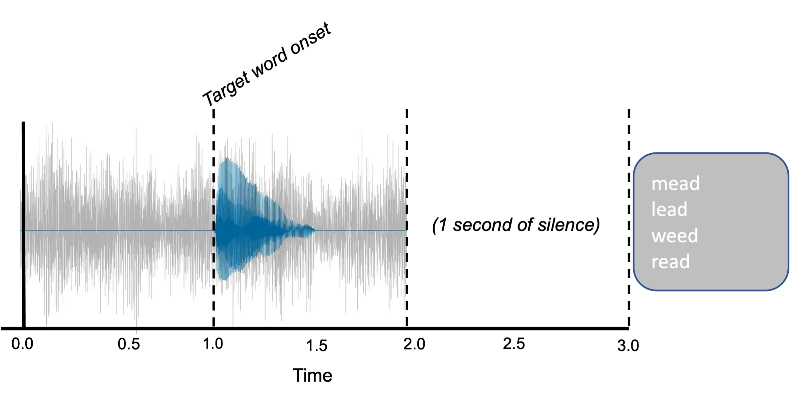
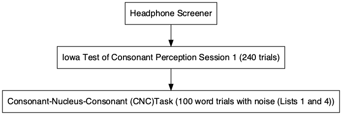

<style type="text/css">
.remark-slide-content {
    font-size: 22px;
    padding: 1em 4em 1em 4em;
}

```{r xaringan-themer, include=FALSE, warning=FALSE}
library(xaringanthemer)
library(xaringanExtra)
style_mono_accent(
  base_color = "#1c5253",
  header_font_google = google_font("Josefin Sans"),
  text_font_google   = google_font("Open Sans", "300", "300i"),
  code_font_google   = google_font("Fira Mono")
)
```
---
background-image:url("images/cocktail.jpeg")

```{r setup, include=FALSE}
options(htmltools.dir.version = FALSE)
```


---
# Closed vs. Open-Set Tasks
+ Open-set

<html>
  <head>
    <title>Audio</title>
  </head>
  <body>
    <script>
      function play() {
        var audio = document.getElementById("audio");
        audio.play();
      }
    </script>
    <input type="button" value="PLAY" onclick="play()">
    <audio id="audio" src="ball_noise.wav"></audio>
  </body>
</html>


--

```{r,fig.width=12, fig.align="center", fig.height=8,echo=FALSE}


```	

---
# Closed vs. Open-Set Tasks
+ Closed-set

  - Fall
  - *Ball*
  - Shawl
  - Wall


```{r,fig.width=12, fig.align="center", fig.height=10,echo=FALSE}
knitr::include_graphics('images/closed1.jpeg')

```	

---
# Issues 

- Sentence based (open-set) tasks are generally preferred as they are the most ecologically valid 
 
- However: 
  + Open-set tasks are difficult to use experimentally
     -  Engages a whole host of processes not related to speech perception
  
- We need a closed-set task that better approximates everyday listening situations

 + Lexical competition
 + Talker variability

---

# Iowa Test of Consonant Perception
.pull-left[
+ 4-AFC closed-set (single word) SiN task 
  - 120 target words
      - Each target word belongs to a set and within the set appear as target and foil
      - Each word spoken by 4 speakers (2 women)
  - Minimal pair foils differing by first consonant
  
+ All analysis scripts, materials, and data are available on our OSF page. 
]
<br> <br>
.pull-right[
```{r, fig.align="center", fig.width=16, fig.height=12, echo=FALSE}


```	
]


---
background-image: url("images/empty_bottle_03.jpeg")

---

background-image: url("images/bob.jpeg")

---
# Procedure
+ Two sessions (1 week apart)
 - Used Gorilla and Prolific
---

# Procedure

.pull-left[

+ Session 1 (*N*=199)

```{r, message=FALSE, warning=FALSE, echo=FALSE}
library(DiagrammeR)
library(DiagrammeRsvg)
library(magrittr)
library(rsvg)
grViz("digraph flowchart {
      # node definitions with substituted label text
      node [fontname = Helvetica, shape = rectangle]        
      tab1 [label = '@@1']
      tab2 [label = '@@2']
      tab3 [label = '@@3']

      # edge definitions with the node IDs
      tab1 -> tab2 -> tab3;
      }

      [1]: 'Headphone Screener'
      [2]: 'Iowa Test of Consonant Perception Session 1 (240 trials)'
      [3]: 'Consonant-Nucleus-Consonant (CNC)Task (100 word trials with noise (Lists 1 and 4))'
      ")%>%


    export_svg %>% 
  charToRaw %>% 
  rsvg_png("graph1.png")


```

```{r,fig.width=12, fig.align="center", fig.height=10,echo=FALSE}


```	
]
--
.pull-right[
+ Session 2 (*N* = 98)

```{r, message=FALSE, warning=FALSE, echo=FALSE}

grViz("digraph flowchart {
      # node definitions with substituted label text
      node [fontname = Helvetica, shape = rectangle]        
      tab1 [label = '@@1']
      tab2 [label = '@@2']
      tab3 [label = '@@3']
      tab4 [label = '@@4']

      # edge definitions with the node IDs
      tab1 -> tab2 -> tab3 -> tab4;
      }

      [1]: 'Headphone Screener'
      [2]: 'Iowa Test of Consonant Perception Session 2 (240 trials)'
      [3]: 'AzBio (20 sentences with noise)'
      [4]: 'Demographics'
      ") %>% 
    export_svg %>% 
  charToRaw %>% 
  rsvg_png("graph2.png")
```

```{r,fig.width=12, fig.align="center", fig.height=10,echo=FALSE}
knitr::include_graphics('graph2.png')

```	
]
---
# Procedure
- Let's try it out!

https://app.gorilla.sc/openmaterials/97811

---
# Reliability
 + Test-Retest
  - ICC = .8
```{r, echo=FALSE, warning=FALSE, message=FALSE}
library(osfr)
library(ggstatsplot)
library(tidyverse)
library(DiagrammeR)
# use opst to read in files from osfpage
d= osf_retrieve_file("https://osf.io/dqm67/") %>%
    osf_download(conflicts = "skip")

icc_itcp<-read_csv("itcp_cnc_azbio_summary.csv")

```


```{r fig.align='center',fig.width=12, fig.align="center", fig.height=6,echo=FALSE,  warning=FALSE, message=FALSE}

session12=ggstatsplot::ggscatterstats(
  data = icc_itcp,
  x = session1,
  y = session2,
  bf.message = FALSE, 
  xlab = "Session 1 of ITCP",
  ylab = "Session 2 of ITCP",
  type= "r", 
  xfill = "#0072B2", # color fill for x-axis marginal distribution
  yfill = "#009E73", # color fill for y-axis marginal distribution
  xalpha = 0.6, # transparency for x-axis marginal distribution
  yalpha = 0.6, # transparency for y-axis marginal distribution
point.size = 4,
results.subtitle=FALSE, 
xsize=1, 
ysize=1, 
ggstatsplot.layer = FALSE, 
ggplot.component = list(theme(text = element_text(size = 20, family="Arial")), ggplot.component=list(
        scale_y_continuous(limits = c(0, 1)),
         scale_x_continuous(limits = c(0, 1)))))

#d=ggsave("Azbio_new1.png", width=12, height=12, dpi=500, type = "cairo")
session12 

```
---
# Validity
+ Session 1 of ITCP and CNC


```{r fig.align='center',fig.width=12, fig.align="center", fig.height=6,echo=FALSE,  warning=FALSE, message=FALSE}

cnc=ggstatsplot::ggscatterstats(
  data = icc_itcp,
  x = session1,
  y = meancnc,
  bf.message = FALSE, 
  xlab = "Session 1 of ITCP",
  ylab = "CNC",
  type= "r", 
  xfill = "#0072B2", # color fill for x-axis marginal distribution
  yfill = "#009E73", # color fill for y-axis marginal distribution
  xalpha = 0.6, # transparency for x-axis marginal distribution
  yalpha = 0.6, # transparency for y-axis marginal distribution
point.size = 4,
results.subtitle=TRUE, 
xsize=1, 
ysize=1, 
ggstatsplot.layer = FALSE, 
ggplot.component = list(theme(text = element_text(size = 20, family="Arial")), ggplot.component=list(
        scale_y_continuous(limits = c(0, 1)),
         scale_x_continuous(limits = c(0, 1)))))

#d=ggsave("Azbio_new1.png", width=12, height=12, dpi=500, type = "cairo")
cnc

```
---
# Validity
+ Session 1 of ITCP and AzBio

```{r fig.align='center',fig.width=12, fig.align="center", fig.height=6,echo=FALSE,  warning=FALSE, message=FALSE}

cnc=ggstatsplot::ggscatterstats(
  data = icc_itcp,
  x = session1,
  y = mean_az,
  bf.message = FALSE, 
  xlab = "Session 1 of ITCP",
  ylab = "AzBio",
  type= "r", 
  xfill = "#0072B2", # color fill for x-axis marginal distribution
  yfill = "#009E73", # color fill for y-axis marginal distribution
  xalpha = 0.6, # transparency for x-axis marginal distribution
  yalpha = 0.6, # transparency for y-axis marginal distribution
point.size = 4,
results.subtitle=TRUE, 
xsize=1, 
ysize=1, 
ggstatsplot.layer = FALSE, 
ggplot.component = list(theme(text = element_text(size = 20, family="Arial")), ggplot.component=list(
        scale_y_continuous(limits = c(0, 1)),
         scale_x_continuous(limits = c(0, 1)))))

#d=ggsave("Azbio_new1.png", width=12, height=12, dpi=500, type = "cairo")
cnc

```


---
# Future 

.pull-left[
+ Validate in lab <br> <br>
  - We have data from 50 participants and data look comparable. <br> <br>
+ Can we use this type of online testing for patients (e.g., cochlear implant patients)

]
--
.pull-right[
```{r,fig.width=8, fig.align="center", fig.height=4,echo=FALSE}
knitr::include_graphics('inlab.png')

```	
]

---

# What Future Me Learned From Past Me

+ Give bonuses for completing second session - *set up separate studies on recruitment platform.*

--

+ Be explicit in your study description. 

--

+ Email subjects multiple times to remind them of an upcoming session.

--

+ Try to make experiment length reasonable

---

class: inverse, center, middle

# Thank You

<svg viewBox="0 0 512 512" style="height:1em;position:relative;display:inline-block;top:.1em;" xmlns="http://www.w3.org/2000/svg">
  <path d="M459.37 151.716c.325 4.548.325 9.097.325 13.645 0 138.72-105.583 298.558-298.558 298.558-59.452 0-114.68-17.219-161.137-47.106 8.447.974 16.568 1.299 25.34 1.299 49.055 0 94.213-16.568 130.274-44.832-46.132-.975-84.792-31.188-98.112-72.772 6.498.974 12.995 1.624 19.818 1.624 9.421 0 18.843-1.3 27.614-3.573-48.081-9.747-84.143-51.98-84.143-102.985v-1.299c13.969 7.797 30.214 12.67 47.431 13.319-28.264-18.843-46.781-51.005-46.781-87.391 0-19.492 5.197-37.36 14.294-52.954 51.655 63.675 129.3 105.258 216.365 109.807-1.624-7.797-2.599-15.918-2.599-24.04 0-57.828 46.782-104.934 104.934-104.934 30.213 0 57.502 12.67 76.67 33.137 23.715-4.548 46.456-13.32 66.599-25.34-7.798 24.366-24.366 44.833-46.132 57.827 21.117-2.273 41.584-8.122 60.426-16.243-14.292 20.791-32.161 39.308-52.628 54.253z"></path>
</svg> @jgeller_phd

pagedown::chrome_print(".html",output="test.pdf")

